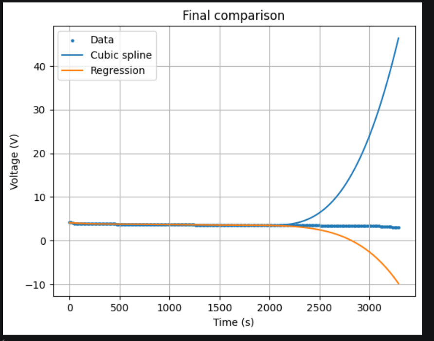
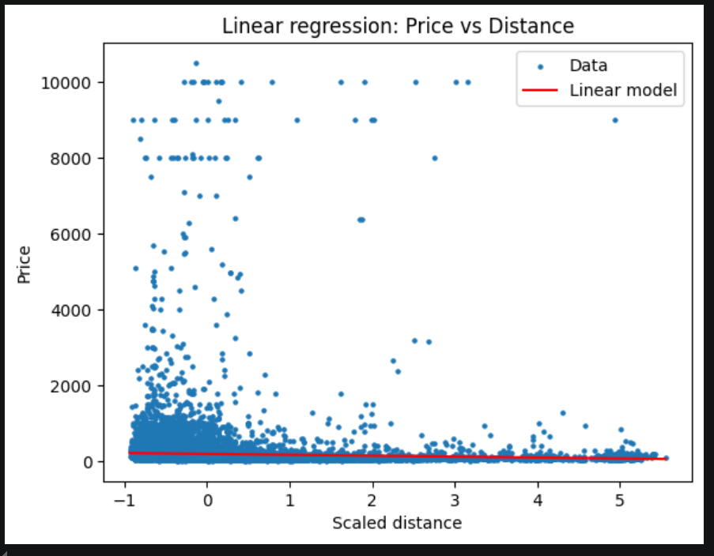
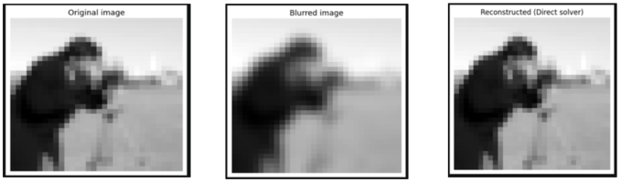
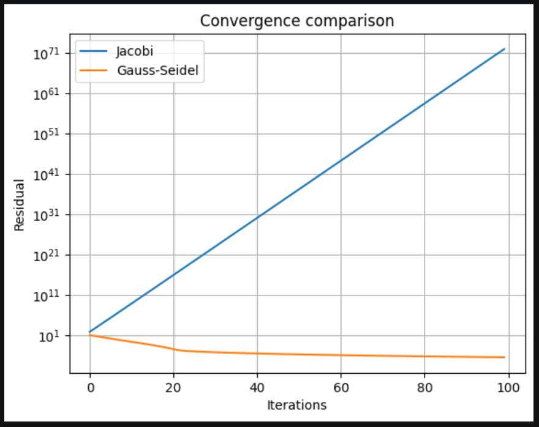

# Applied Mathematics Final Project

**University of Trieste**  
**Author:** Alexis Jose Guerin Anangmo Solefack

## Overview

This project was developed as part of the **Applied Mathematics** course and focuses on the application of numerical methods to three real-world problems:

1. **Battery Discharge Analysis** using interpolation and regression.
2. **Airbnb Price Prediction** using least-squares regression models.
3. **Image Deblurring** using direct and iterative linear system solvers.

The objective is to compare different numerical techniques, evaluate their numerical stability, and analyze their effectiveness on real datasets.

---

## Project Structure

```text
Final_Project/
├── AppMaths_Final_Project.ipynb
├── battery_discharge.csv
├── listings-Rome.csv
├── images/
│   ├── battery_comparison.PNG
│   ├── airbnb_regression.PNG
│   ├── deblurring_results.PNG
│   └── convergence_analysis.PNG
└── README.md
```

---

## Requirements

Install the required Python packages:

```bash
pip install numpy pandas matplotlib scipy scikit-image
```

Libraries used:

- NumPy
- Pandas
- Matplotlib
- SciPy
- scikit-image

---

# Assignment 1: Battery Discharge Analysis

## Objective

Study the discharge cycle of a lithium-ion battery and estimate voltage values through interpolation, extrapolation, and regression techniques.

## Methods

- Manual Lagrange interpolation
- SciPy Lagrange interpolation
- Cubic spline interpolation
- Polynomial regression (least squares)
- Numerical estimation of the time at which the battery voltage reaches a specified threshold

## Main Findings

- High-degree polynomial interpolation suffers from the **Runge phenomenon**.
- Polynomial extrapolation becomes unstable outside the sampled interval.
- Cubic spline interpolation produces smooth and reliable approximations.
- Regression models are generally more robust but less accurate than interpolation.

## Results

### Comparison of Interpolation and Regression Methods

<p align="center">
  
</p>

*Figure 1. Battery voltage evolution and comparison of interpolation and regression methods.*

---

# Assignment 2: Airbnb Price Prediction

## Objective

Analyze Airbnb listings in Rome and investigate the relationship between property characteristics and rental prices.

## Methods

- Linear regression
- Quadratic regression
- Least squares using Normal Equations
- Least squares using QR Factorization
- Condition number analysis

## Main Findings

- The selected explanatory variables only partially explain price variability.
- QR factorization provides greater numerical stability than Normal Equations.
- Different room categories exhibit different pricing trends.
- Combining multiple variables slightly improves predictive performance.

## Results

### Regression Analysis

<p align="center">
  
</p>

*Figure 2. Example of regression results obtained from the Airbnb dataset.*

---

# Assignment 3: Image Deblurring

## Objective

Recover a blurred image by solving a linear inverse problem associated with a Gaussian blur operator.

## Methods

- Construction of a Gaussian blur matrix
- Direct sparse solver
- Jacobi iterative method
- Gauss-Seidel iterative method
- Mean Squared Error (MSE) analysis
- Noise sensitivity study

## Main Findings

- The direct solver provides the most accurate reconstruction.
- Gauss-Seidel converges faster than Jacobi.
- Image restoration is highly sensitive to noise.
- Deblurring is an ill-posed inverse problem and may require regularization.

## Results

### Image Reconstruction

<p align="center">
  
</p>

*Figure 3. Original image, blurred image, and reconstructed image.*

### Convergence Analysis

<p align="center">
  
</p>

*Figure 4. Comparison of Jacobi and Gauss-Seidel convergence behaviour.*

---

# Conclusions

This project highlights the importance of selecting appropriate numerical methods according to the problem considered.

- **Cubic splines** are preferable for battery-data interpolation.
- **QR factorization** improves numerical stability in least-squares problems.
- **Direct solvers** achieve the best deblurring results, while iterative methods offer a useful trade-off between computational cost and accuracy.

These experiments demonstrate both the strengths and limitations of numerical techniques when applied to practical engineering and data-analysis problems.

---

# Running the Project

1. Download or clone the repository.
2. Ensure all datasets are located in the project directory.
3. Open `AppMaths_Final_Project.ipynb` using:
   - Jupyter Notebook
   - JupyterLab
   - VS Code
   - Google Colab
4. Execute all cells sequentially.

Example:

```python
pd.read_csv("battery_discharge.csv")
pd.read_csv("listings-Rome.csv")
```
